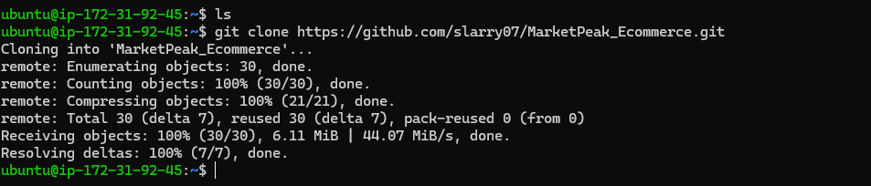

# E-Commerce Platform Deployment with Git, Linux,AWS

# Marketpeak_Ecommerce

This Project is to develop an e-commerce website called MarketPeak using Git, Linux which will be deployed on an AWS EC2 instace. The process of doing that are as follows:

# Implement Version Control with Git

1.1 Creation of project directory named Marketpeak_Ecommerce

# AWS Deployment 

2.1 Setup an AWS EC2 Instance

2.2 Cloning my Github repository on the Linux Server  deployed

2.3 Installing a Web Server on EC2

sudo apt-get update -y
sudo apt instail -y
sudo systemctl start httpd
sudo systemctl enable httpd

2.4 Configuring httpd for Website

sudo rm -rf /var/www/html/*
sudo cp -r ~/MarketPeak_Ecommerce/* /var/www/html/
sudo systemctl reload httpd

2.5 Accessing Website from Browser

# Continuous integration and Deployment Workflow
3.1 creating a new branch called development for bug fixing 

# Conclusion 
This project demonstrated the successful deployment of a web application on an AWS EC2 instance. It required configuring Apache, troubleshooting errors, and managing Git workflows. Through this project, I gained hands-on experience in deployment and resolved challenges such as Git authentication, file permissions, and merge conflicts.

# Challenges and Solutions

1.Git branching Issue

Issue:
local repository was initialize to use "master" while the remote repository was "main"

# Solution:
Created a new branch for main locally (git branch main)

Rebased the main branch by pulling the remote repository and set Git Configuration for pull.rebase to true (git config pull.rebase=true && git pull origin main)

Pushed the main branch to the remote repository (git push origin main)

Deleted the master branch locally and remotely (git branch -D master)

 Permission for updating the httpd project files in /var/www/html
Issue:
I wanted to update the project code in the httpd folder but git pull was not permitted in the folder

Solution:
Updated the code in the home directory and copy to the httpd folder